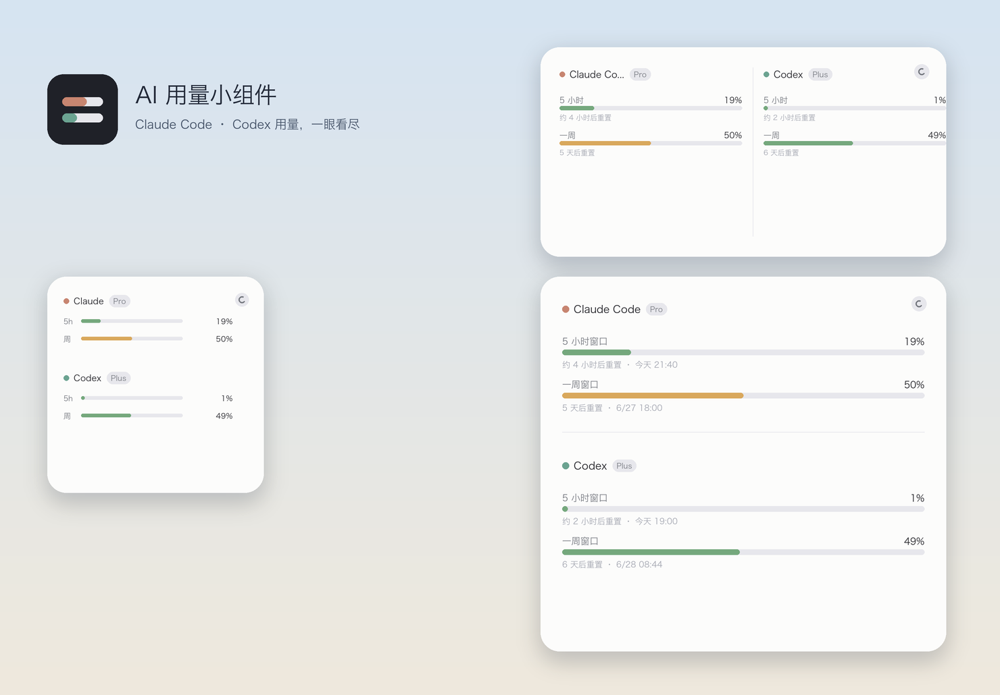

# AI Usage Widget · AI 用量小组件



一个 macOS 小工具，在**桌面小组件**和**菜单栏**里实时显示 **Claude Code** 与 **Codex**
的 **5 小时**和**一周**用量（百分比 + 重置倒计时，颜色按吃紧程度变化）。
跟随系统明暗外观，数据全程在本机、不出网。

- 桌面小组件：小 / 中 / 大三种尺寸
- 菜单栏图标：点击弹出数据面板，内含设置（外观 / 开机自启动 / 退出）
- 外观：跟随系统 / 强制白 / 强制黑（菜单里切，桌面组件同步生效）
- 运行时面板每 30 秒自动刷新

## 支持哪些账号

| 工具 | 取数方式 | 支持 |
|------|----------|------|
| Codex | 读本地 `~/.codex/sessions` 的 `rate_limits` | ✅ ChatGPT 登录的 Plus / Pro / Business（百分比按各自套餐自动反映）；❌ 用 API key 按量付费的没有 5h/周窗口 |
| Claude Code | 调 `api.anthropic.com/api/oauth/usage`，凭证取自 Keychain | ✅ 订阅登录的 Pro / Max 5x / Max 20x / Team（按各自套餐自动反映，无需改代码）；❌ 纯 API/console 计费机制不同 |

> 每个人读自己机器上的本地数据与凭证，百分比自动对应本人套餐。

## 架构

沙盒小组件只能联网、读不到本地文件/Keychain，因此由一个**本地 Agent** 取数，
通过 `127.0.0.1` 暴露给小组件和菜单栏 app：

```
~/.codex/sessions/*.jsonl ─┐
  primary(5h)/secondary(周) ├─► usage-agent.py ──► http://127.0.0.1:47615/usage ──► Widget / 菜单栏 app
Keychain(Claude 凭证)      ─┘   · Codex 读本地 session
                                · Claude 调 /api/oauth/usage（过期自动刷新并写回 Keychain）
```

数据不出本机，无云端。

## 下载安装（推荐）

到 [Releases](https://github.com/charleshan7/AIUsageWidget/releases/latest) 下载 `AIUsageWidget-v*.dmg`：
拖 App 到「应用程序」→ 右键运行「① 安装后台服务.command」→ 打开 App 并在桌面添加小组件。
（详见 DMG 内「使用说明.txt」，含 Gatekeeper 解隔离与代理配置。）

## 从源码构建

需要 macOS 14+、[XcodeGen](https://github.com/yonsm/XcodeGen)（`brew install xcodegen`）、Xcode。

```bash
# 1) 生成图标（可选，已含生成结果）
python3 make_icons.py

# 2) 构建菜单栏 app + 小组件
xcodegen generate
xcodebuild -scheme AIUsageWidget -configuration Release build

# 3) 安装后台取数 Agent（登录自启、保活）
bash agent/install.sh

# 4) 打开 build 出的 AIUsageWidget.app（菜单栏出现图标）；
#    再在桌面右键「编辑小组件」搜「AI 用量」添加桌面组件
```

或用 `bash release/package-dmg.sh` 打出可分发的 `.dmg`。

卸载 Agent：`bash agent/install.sh remove`

## 配置

`~/.config/ai-usage-widget/config.json`（可选）：

```json
{ "port": 47615, "proxy": "http://127.0.0.1:7897", "cache_seconds": 60 }
```

- `proxy`：**默认直连**。若你所在网络需要代理才能访问 `api.anthropic.com`，在此填写
  （或设环境变量 `HTTPS_PROXY`）。Codex 侧是纯本地读取，不需要网络。
- 改了 `port` 要同步改 `Config.xcconfig` 里的 `AI_USAGE_ENDPOINT`。

## 隐私

所有数据（用量百分比、凭证）只在本机处理：Codex 读本地文件，Claude 直接调官方接口，
token 存在系统 Keychain。Agent 只监听 `127.0.0.1`，不对外开放。

设计细节见 [docs/superpowers/specs/2026-06-21-ai-usage-widget-design.md](docs/superpowers/specs/2026-06-21-ai-usage-widget-design.md)。

## License

MIT，见 [LICENSE](LICENSE)。
